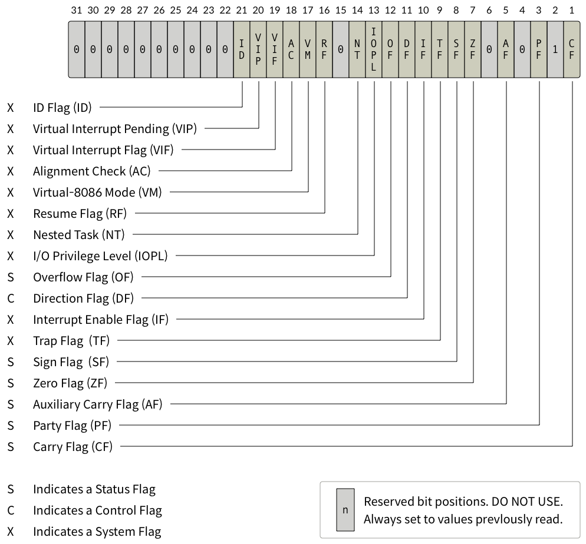
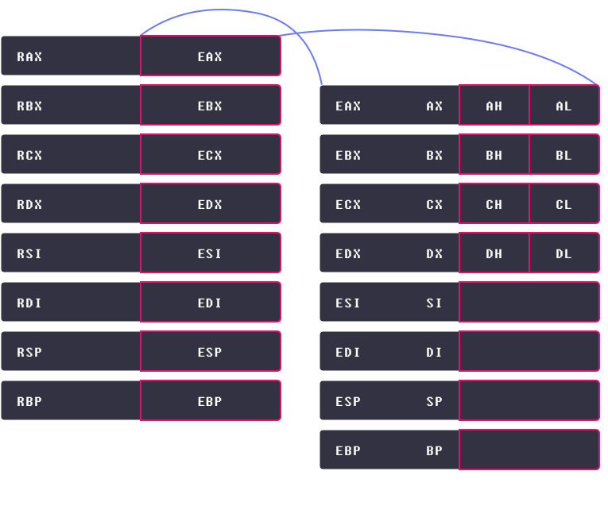
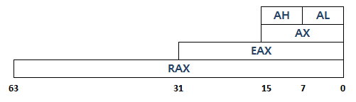

# 컴퓨터 구조와 명령어 집합 구조

## 컴퓨터 구조

``컴퓨터 구조`` : 컴퓨터가 **효율적으로 작동**할 수 있도록 하드웨어 및 소프트웨어의 **기능을 고안**하고, 이들을 **구성**하는 방법

다음은 컴퓨터 구조의 세부 분야이다.

``기능 구조의 설계`` : 컴퓨터가 **연산을 효율적**으로 하기 위해 **어떤 기능**들이 컴퓨터에 **필요한지 고민**하고, **설계**하는 분야

``명령어 집합구조`` : **CPU가 처리해야하는 명령어를 설계**하는 분야  

``마이크로 아키텍처`` : 정의된 **명령어 집합을 효율적으로 처리**할 수 있도록, CPU의 **회로를 설계**하는 분야

### 컴퓨터 구조의 세부 분야

- 기능 구조의 설계()
    - 폰 노이만 구조
    - 하버드 구조
    - 수정된 하버드 구조

- 명령어 집합구조
    - x86, x86-64
    - ARM
    - MIPS
    - AVR

- 마이크로 아키텍처
    - 캐시 설계
    - 파이프라이닝
    - 슈퍼 스칼라
    - 분기 예측
    - 비순차적 명령어 처리

- 하드웨어 및 컴퓨팅 방법론
    - 직접 메모리 접근

## 폰 노이만 구조

폰 노이만은 컴퓨터에 **연산, 제어, 저장** 기능이 필요하다고 주장  
-> 이를 위해 근대에는 ``중앙처리장치(연산, 제어)``, ``기억장치(저장)`` 을 사용함.

추가적으로 ``버스``를 통해 데이터나 신호를 교환

### 중앙처리장치(CPU)

``CPU`` : 프로그램의 **연산을 처리**, **시스템을 관리**함(코드를 불러오고, 실행, 결과를 저장)

``산술논리장치(ALU)(산술/논리 연산)``, ``제어장치(제어)``, ``레지스터(데이터 저장, 빠른 기억장치)`` 등으로 구성

### 기억장치

``기억장치`` : 필요한 여러 **데이터를 저장**, 용도에 따라 **주기억장치**, **보조기억장치**로 분류  

``주기억장치`` : 프로그램 실행과정에서 필요한 데이터들을 **임시로 저장**(예 : ``RAM``)

``보조기억장치`` : 운영체제, 프로그램 등과 같은 데이터를 **장기간 보관**(예 : ``HDD``, ``SSD``)

### 버스

``버스`` : 부품 간, 컴퓨터 간 사이에 **신호를 전송**하는 통로  

``데이터 버스, 주소 버스, 제어 버스, 랜선, 데이터 전송 소프트웨어, 프로토콜 등등``

## 명령어 집합 구조(ISA)

``명령어 집합 구조`` : CPU가 해석하는 ``명령어의 집합``  

``IA-32, x86-64(x64), MIPS, AVR 등`` 많은 종류가 있고, 용도에 맞게 사용함.(예 : ``x86-64(고성능 프로세서)``, ``ARM, MIPS, AVR(임베디드 장비)``)

현재는 **x86-64**가 압도적인 점유율을 가지고 있음

# x86-64 아키텍처

## x86-64 아키텍처

x86-64의 시초는 1999년 AMD에서 AMD64 아키텍처를 발표하면서 시작되었다.  

결론적으로, 현재 개인용 컴퓨터는 대부분 x86-64를 사용한다.

### n 비트 아키텍처

``64비트, 32비트`` 아키텍처  
-> CPU가 **한 번에 처리**할 수 있는 데이터의 크기  
--> ``WORD`` : CPU가 이해할 수 있는 단위

### WORD가 크면 유리한 점

예전에 **32비트** 아키텍처를 사용했을 때 **가상메모리 최대 크기가 4GB** 였다.  
-> 현대의 게임, 소프트웨어를 돌리기에는 **정말 부족!!**  

**64비트** 아키텍처는 이론상 **가상메모리 최대 크기가 16EB(16,777,216 TB)** 이다.

## x86-64 아키텍처 : 범용/세그먼트/명령어 포인터 레지스터

``레지스터`` : 다양한 용도로 사용, 보통 **CPU가 데이터를 빠르게** 저장하고 사용하는데 이용

레지스터 종류에는 ``범용 레지스터, 세그먼트 레지스터, 명령어 포인터 레지스터, 플래그 레지스터``가 있다.

### 범용 레지스터

``범용 레지스터`` : **일반적인** 레지스터(다양하고, 각각의 주 용도가 있다.)  

|이름|주 용도|
|---|---|
|``rax``|함수의 **반환 값**|
|``rbx``|주된 용도 **없음**|
|``rcx``|반복문의 **반복 횟수**, 각종 **연산의 시행 횟수**|
|``rdx``|주된 용도 **없음**|
|``rsi``|데이터를 옮길 때 **원본**을 가리키는 **포인터**|
|``rdi``|데이터를 옮길 때 **목적지**를 가리키는 **포인터**|
|``rsp``|사용중인 **스택의 위치**를 가리키는 **포인터**|
|``rbp``|**스택의 바닥**을 가리키는 **포인터**|

### 세그먼트 레지스터

``cs, ss, ds, es, fs, gs`` 총 6가지 세그먼트 레지스터가 존재(16비트 크기)  
-> 물론 x64에서는 **용도가 거의 없음**

현대에서 ``cs(코드 영역)``, ``ds(데이터 영역)``, ``ss(스택 메모리 영역)`` 을 가리킬 때 사용하는 레지스터를 제외하고, 나머지는 자유롭게 사용(운영체제 별로 다름)

### 명령어 포인터 레지스터

``명령어 포인터 레지스터(rip, 8바이트)`` : CPU가 **어느 부분의 코드를 실행**할 지 가리키는 **포인터**

## x86-64 아키텍처 : 플래그 레지스터

### 플래그 레지스터

``플래그 레지스터`` : **현재 상태를 저장**하고 있는 레지스터  

  

최대 64개의 플래그를 사용할 수 있지만, **보통 20개 정도 사용**  

|플래그|의미|
|---|---|
|``CF(Carry Flag)``|``부호 없는`` 수의 **연산 결과**가 **비트의 범위를 넘을 경우** 설정|
|``ZF(Zero Flag)``|**연산의 결과가 0일 경우**|
|``SF(Sign Flag)``|**연산의 결과가 음수일 경우**|
|``OF(Overflow Flag)``|``부호 있는`` 수의 **연산 결과**가 **비트 범위를 넘을 경우**|

## x86-64 아키텍처 : 레지스터 호환

### 레지스터 호환

위에서 살펴봤던 범용 레지스터는 **64비트 전용**이다.  
-> 물론 **32, 16비트 전용** 레지스터도 있다.  

64, 32, 16.. 비트 등등이 호환되기 위해 아래의 이미지와 같이 32비트인 **eax, ebx...** 등등이 있고, 16비트인 **ax, bx...** 등등이 있다.

  

# 결론

## 강의 요약

- ``범용 레지스터(General Register)``: **주 용도**는 있으나, **그 외의 용도로도 자유롭게 사용**할 수 있는 레지스터. x64에는 ``rax, rbx, rcx, rdx, rsi, rdi, rsp, rbp, r8-r15``가 있다.
- ``세그먼트 레지스터(Segment Register)``: 과거에는 메모리 세그멘테이션이나, 가용 메모리 공간의 확장을 위해 사용됐으나, 현재는 주로 **메모리 보호를 위해 사용**되는 레지스터. x64에는 ``cs, ss, ds, es, fs, gs``가 있다.
- ``플래그 레지스터(Flag Register)``: **CPU의 상태를 저장**하는 레지스터
- ``명령어 포인터 레지스터(Instruction Pointer Register, IP)``: **CPU가 실행해야할 코드를 가리키는** 레지스터. x64에서는 ``rip``가 있다.

# 퀴즈
1. rax = 0x0123456789abcdef 일 때, ``ax의 값``은?  
답 : ``0xcdef``

2. rax = 0x0123456789abcdef 일 때, ``al의 값``은?  
답 : ``0xef``

3. rax에서 rbx를 뺐을 때, ZF가 설정되었다. rax와 rbx의 대소를 비교하시오.  
답 : ``==``

4. rax = 0x0123456789abcdef 일 때, ``ah의 값``은?  
답 : ``0xcd``

5. rax = 0x0123456789abcdef 일 때, ``eax의 값``은?  
답 : ``0x89abcdef``

rax(64비트)  
-> eax(하위 32비트)  
--> ax(하위 16비트)  
---> ah(상위 8비트)  
---> al(하위 8비트)

