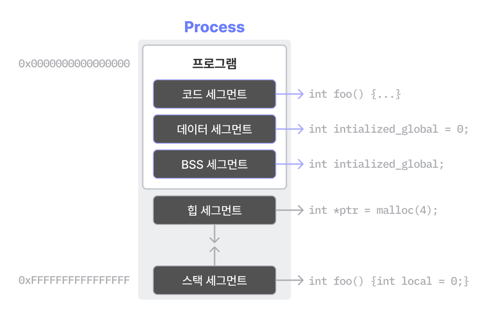
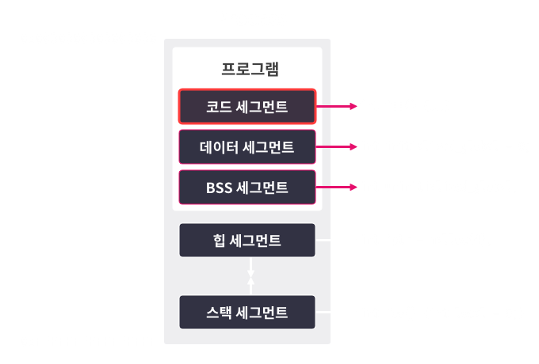
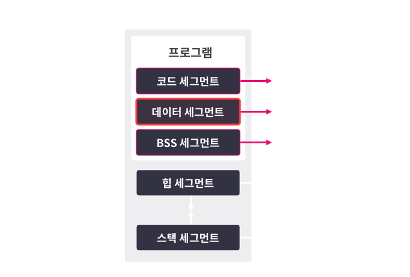
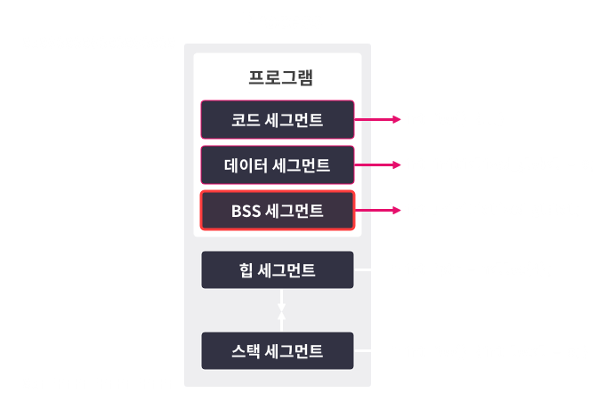
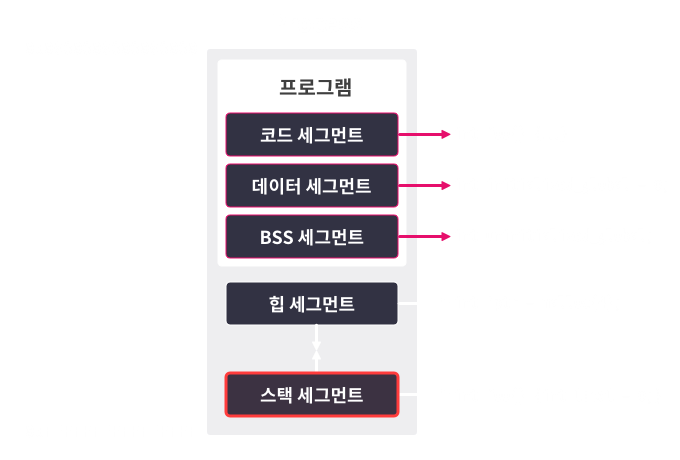
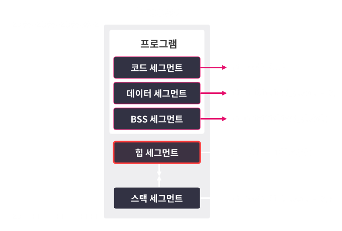

# 리눅스 프로세스의 메모리 구조

## 세그먼트

``세그먼트`` : 리눅스에서 **메모리를 용도별로 나눈 것**  
-> ``코드 세그먼트, 데이터 세그먼트, BSS 세그먼트, 힙 세그먼트, 스택 세그먼트``가 있다.  

  

각 용도에 맞게 ``읽기, 쓰기, 실행`` 권한을 줄 수 있다.  

## 코드 세그먼트



``코드 세그먼트`` : **실행 가능한 기계 코드**가 위치하는 영역  

예를 들면, 아래 main함수를 컴파일하면 ``554889e5b8697a00005dc3`` 라는 기계 코드로 바뀌고, 이 것이 코드 세그먼트에 위치한다.  

```c
int main() { return 31337; }
```

## 데이터 세그먼트

  

``데이터 세그먼트`` : 컴파일 시점에 **값이 정해진 전역 변수 및 전역 상수**들이 위치(**값이 변할 수 있는 데이터**)

``rodata 세그먼트`` : **값이 변하면 안되는** 데이터가 위치(**문자열, 전역상수**)

아래 코드에서 주석을 보면 이해가 될 것이다.  

```c
int data_num = 31337;                       // data
char data_rwstr[] = "writable_data";        // data
const char data_rostr[] = "readonly_data";  // rodata
char *str_ptr = "readonly";  // str_ptr은 data, 문자열은 rodata

int main() { ... }
```

## BSS 세그먼트

 

``BSS 세그먼트`` : 컴파일 시점에 **값이 정해지지 않은 전역 변수**가 위치  
-> 프로그램이 시작될 때, 모두 **0으로 초기화**  

아래 코드에서 ``bss_data`` 가 BSS 세그먼트에 있다.

```c
int bss_data;

int main() {
  printf("%d\n", bss_data);  // 0
  return 0;
}
```

## 스택 세그먼트

 

``스택 세그먼트`` : **프로세스의 스택**이 위치하는 영역(**인자, 지역 변수...**)  
-> **스택 프레임** 이라는 단위를 사용  

쉽게 말하면, 아래 코드를 보면 ``call_true`` 가 호출될 지, ``call_false`` 가 호출될 지 알 수 없으므로, 함부로 **스택 프레임을 미리 계산해서 할당할 수 없다.**  
-> 그래서 운영체제에서는 이 스택 프레임을 약간 할당해주고, 부족하면 확장한다.  

아래 코드에서 ``choice`` 가 스택에 저장된다.

```c
void func() {
  int choice = 0;

  scanf("%d", &choice);

  if (choice)
    call_true();
  else
    call_false();

  return 0;
}
```

## 힙 세그먼트

 

``힙 세그먼트`` : **힙 데이터**가 위치하는 세그먼트(**동적 할당**)  

아래 코드는 ``heap_data_ptr`` 에 동적할당하고, 31337을 넣은 상황이다.  

``heap_data_ptr`` 은 지역변수이므로, **스택** 에 위치하고, **힙 세그먼트** 의 주소를 가리킨다.

```c
int main() {
  int *heap_data_ptr =
      malloc(sizeof(*heap_data_ptr));  // 동적 할당한 힙 영역의 주소를 가리킴
  *heap_data_ptr = 31337;              // 힙 영역에 값을 씀
  printf("%d\n", *heap_data_ptr);  // 힙 영역의 값을 사용함
  return 0;
}
```

# 결론

## 결론

|세그먼트|역할|일반적인 권한|사용 예|
|---|---|---|---|
|``코드 세그먼트``|**실행 가능한 코드**가 저장된 영역|**읽기, 실행**|main() 등의 함수 코드|
|``데이터 세그먼트``|**초기화된 전역 변수 또는 상수**가 위치하는 영역|**읽기와 쓰기** 또는 **읽기** 전용|초기화된 전역 변수, 전역 상수|
|``BSS 세그먼트``|**초기화되지 않은 데이터**가 위치하는 영역|**읽기, 쓰기**|초기화되지 않은 전역 변수|
|``스택 세그먼트``|**임시 변수**가 저장되는 영역|**읽기, 쓰기**|지역 변수, 함수의 인자 등|
|``힙 세그먼트``|실행중에 **동적으로 사용**되는 영역|**읽기, 쓰기**|malloc(), calloc() 등으로 할당 받은 메모리|

# 퀴즈

```c
#include <stdlib.h>
int a = 0xa;
const char b[] = "d_str";
int c;
int foo(int arg) {
  int d = 0xd;
  return 0;
}
int main()
{
  int *e = malloc(sizeof(*e));
  return 0;
}
```

1. ``"d_str"``이 위치하는 세그먼트는 어디인가?  
답 : ``읽기 전용 데이터(rodata)``

2. ``c``가 위치하는 세그먼트는 어디인가?  
답 : ``BSS``

3. ``d``가 위치하는 세그먼트는 어디인가?  
답 : ``스택``

4. ``foo``가 위치하는 세그먼트는 어디인가?  
답 : ``코드``

5. ``a``가 위치하는 세그먼트는 어디인가?  
답 : ``데이터``

6. ``e``는 어느 세그먼트의 데이터를 가리키는가?  
답 : ``힙``

7. ``b``가 위치하는 세그먼트는 어디인가?  
답 : ``읽기 전용 데이터(rodata)``
